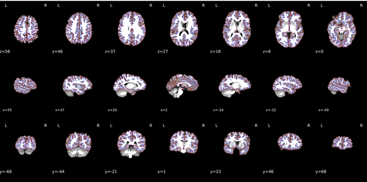
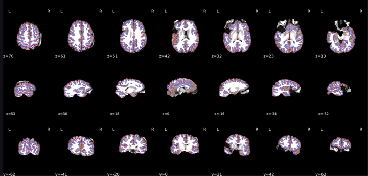
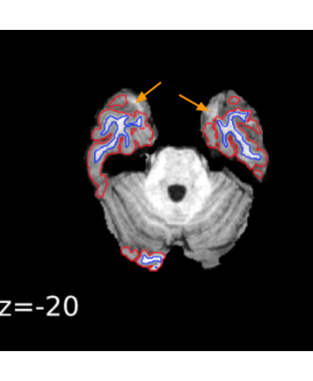
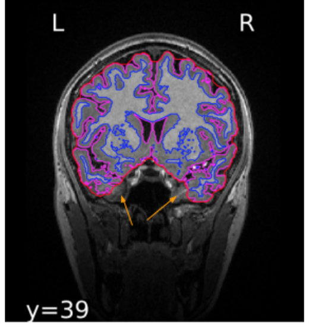
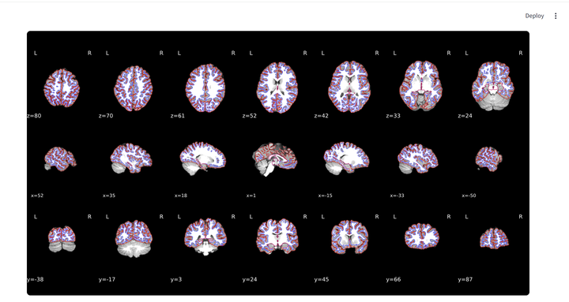
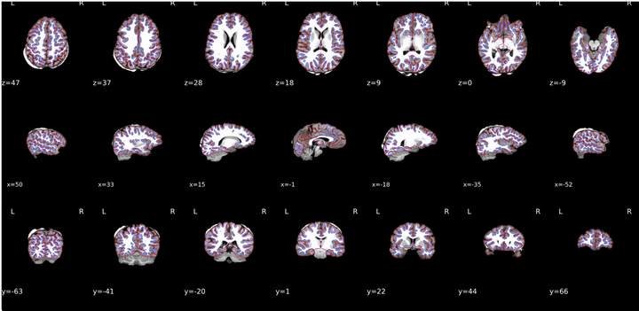
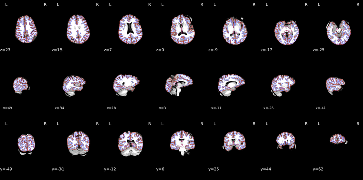
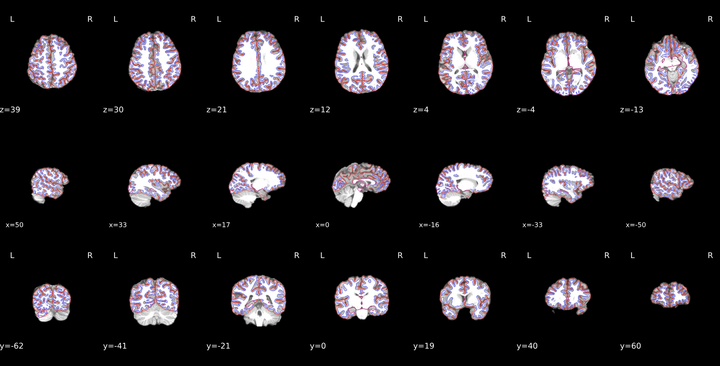
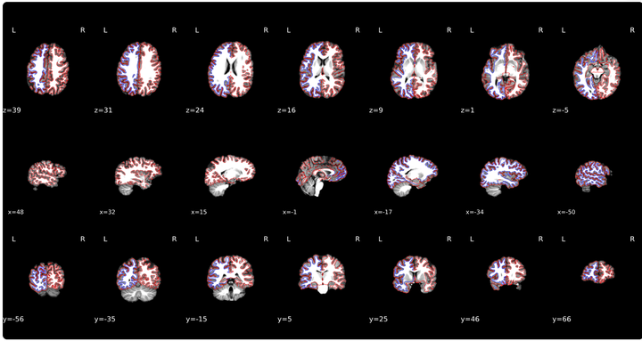

# FreeSurfer QC

## Quick reference

| Rating | When to use |
|--------|-------------|
| **PASS** | Red and blue outlines follow brain anatomy; no major cortex missing; cerebellum may be partly excluded |
| **FAIL** | Major cortex excluded, outlines in skull, or segmentation clearly wrong |
| **UNCERTAIN** | Borderline case — flag for supervisor review |

**In the app:** Open each participant × session, review the recon-all figure (red = outer brain boundary, blue = white matter), check all axes, then rate.

**Sample data:** `sample_data/fmriprep/<subject>/figures/` (same tree as fMRIPrep; see `pipelines/freesurfer/qc.json`).

---

## 1. What you are checking

FreeSurfer reconstructs cortex from a T1w scan. Your job is to confirm the **red** (brain/skull-stripped boundary) and **blue** (white matter) outlines look correct — not to catch every tiny flaw.

Small imperfections are normal. Fail only when errors would likely affect downstream analysis.

---

## 2. Outlines — what they mean

| Outline | Meaning | Fail if… |
|---------|---------|----------|
| **Red** | Outer brain boundary (skull strip) | Major cortex missing, or line runs into skull |
| **Blue** | White matter boundary | Major WM missing, or line runs into skull / non-brain tissue |

**Cerebellum:** The red outline should follow cortex and **may exclude** cerebellum. Missing cerebellum from the outline can still **PASS**.

Always view **all axes** before rating — some problems show in only one view.

---

## 3. Good example

*Red traces the brain boundary; blue traces white matter. No skull in the outlines; cerebellum excluded.*

**→ PASS**

---

## 4. Common issues

### Over-inclusive masking (skull visible in image)

Skull may appear in the background. This is **not** an automatic fail — only fail if the **red or blue outline extends into skull**.

---

### Underexclusive masking (cortex missing from outline)

Major parts of cortex excluded from the red outline → **FAIL**.

---

### Temporal lobe excluded

Check all axes. Major temporal-lobe exclusion → **FAIL** or **UNCERTAIN**.

---

### Missing cerebellum from outline

Can still **PASS** if cortex is otherwise fine.

---

### Minor skull in background

Fail only if outlines cross into skull.

---

### Minor cerebellum inclusion

Outline slightly into cerebellum → usually **not FAIL**, but note it (e.g. slices x=17, x=−16, y=−62).

---

### Missing red or blue outline

Cannot judge segmentation properly → **UNCERTAIN** or **FAIL**.

---

## 5. Euler values

Euler numbers are shown in the app (typical range **−150 to 2**).

- Use Euler as **one signal**, not the only rule.
- Do **not** fail on Euler alone if the segmentation looks good visually.
- Study-wide Euler distributions may inform final decisions.
