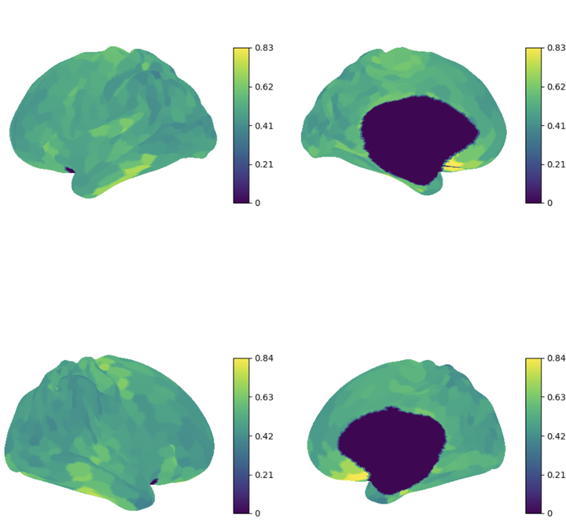
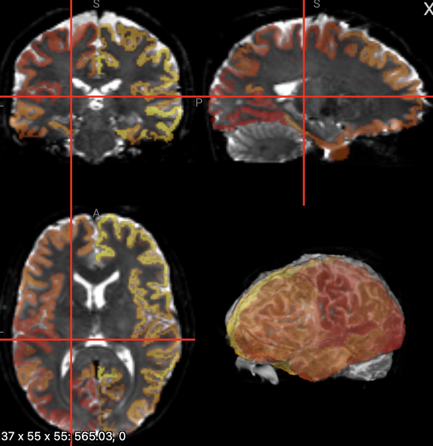
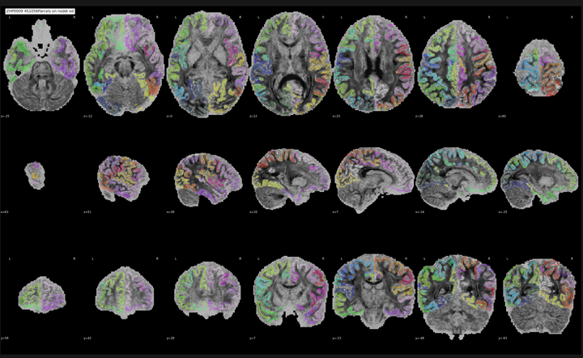
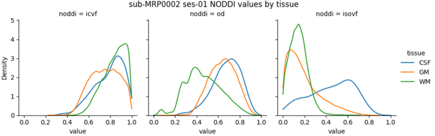

# NODDIreg QC

## Quick reference

| Rating | When to use |
|--------|-------------|
| **PASS** | Surface maps, parcellation alignment, and tissue curves all look plausible |
| **FAIL** | Large holes on cortex, clear misalignment, or broken / overlapping tissue curves |
| **UNCERTAIN** | Borderline — flag for supervisor review |

**Where files live:** `sample_data/noddireg/<subject>/`  
- PNGs → `figures/`  
- NIfTIs (`*_dwiref.nii.gz`, `*_dseg.nii.gz`) → subject root  

**In QC-Studio:** Use task `noddireg_od_icvf_isovf` (surface PNGs), `noddireg_parcellation_overlay` (Niivue + slice PNGs), `noddireg_density` (tissue curves). Ignore `.tsv`, `.txt`, `.pscalar.nii`.

---

## Files per session (`figures/`)

| File pattern | Checks |
|--------------|--------|
| `*_icvf_mean_qc.png` | ICVF on cortical surface |
| `*_od_mean_qc.png` | OD on cortical surface |
| `*_isovf_mean_qc.png` | ISOVF on cortical surface |
| `*_desc-4S1056Parcels_model-noddi_mdp-icvf_qa.png` | Parcellation on ICVF (slices) |
| `*_desc-4S1056Parcels_model-noddi_mdp-od_qa.png` | Parcellation on OD (slices) |
| `*_desc-dsegtissue_model-noddi_density.png` | ICVF / OD / ISOVF by tissue (CSF, GM, WM) |

**Metrics:** ICVF = intracellular volume fraction · OD = orientation dispersion · ISOVF = isotropic volume fraction

---

## Step 1 — Surface QC (3 PNGs)

*Example: 2×2 surface layout — LH lateral (top-left), LH medial (top-right), RH lateral (bottom-left), RH medial (bottom-right).*

**PASS if:**
- Smooth, anatomically plausible patterns on cortex
- Most of the surface is colored (few large gaps)
- ICVF, OD, and ISOVF all look reasonable
- Mild left–right asymmetry is OK

**FAIL if:**
- Large holes or flat/near-zero maps across cortex
- Obvious artifact patches or sharp discontinuities
- Strong unexplained left–right differences

---

## Step 2 — Parcellation alignment (Niivue + slice PNGs)

### 3D overlay (QC-Studio: `noddireg_parcellation_overlay`)

Subject-level NIfTIs:
- `sub-XXXX_*_space-T1w_dwiref.nii.gz` — DWI reference (one file per subject)
- `sub-XXXX_space-T1w_ref-dwiref_desc-4S1056Parcels_dseg.nii.gz` — parcellation on DWI grid

**PASS if:** Colored parcels sit on brain tissue and follow anatomy (not shifted into ventricles, skull, or background).

**FAIL if:** Clear shift, rotation, or scale error; parcels in non-brain tissue; large missing regions.

### Slice mosaic PNGs

Same checks as above on the 2D mosaic figures (`*_mdp-icvf_qa.png`, `*_mdp-od_qa.png`).

---

## Step 3 — Tissue density curves (1 PNG)

*Three panels (ICVF, OD, ISOVF). Each panel has CSF, GM, and WM curves. Not a brain slice — voxel histograms by tissue.*

**PASS if:**
- **ICVF:** WM peak right of GM; CSF usually separate from brain tissue
- **OD:** Tissue curves visibly different (not fully overlapping)
- **ISOVF:** CSF peak right of WM/GM; CSF separable from brain tissue

**FAIL if:**
- CSF / GM / WM curves overlap almost completely in any panel
- ICVF: WM and GM peaks at same position
- ISOVF: CSF not separated from brain tissue
- Any curve is a spike at 0 or 1, or looks flat / empty
