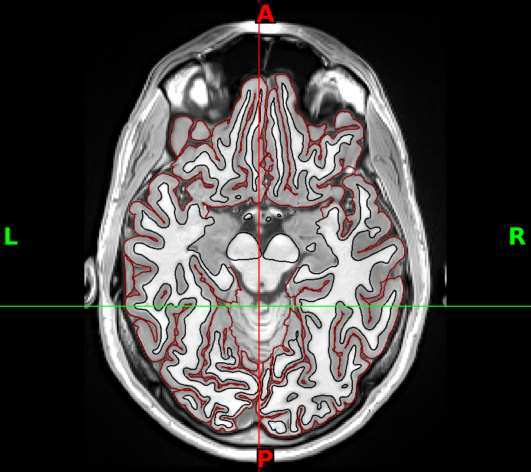
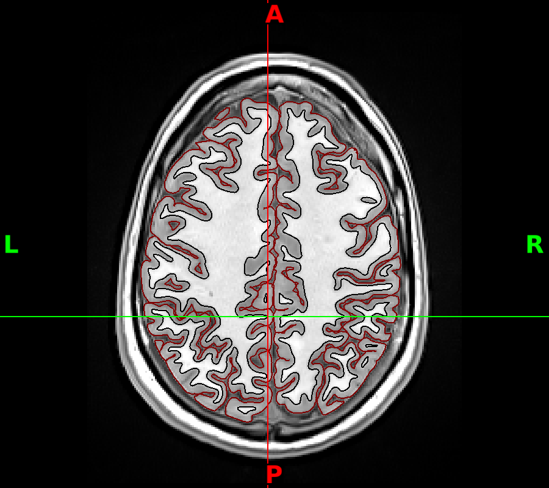
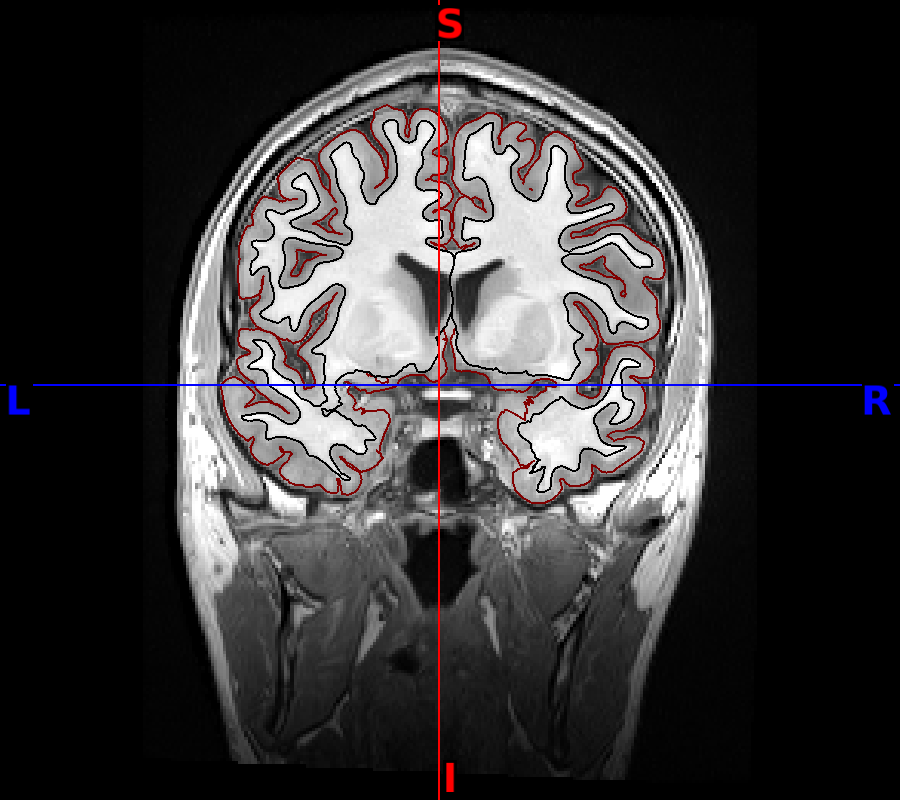
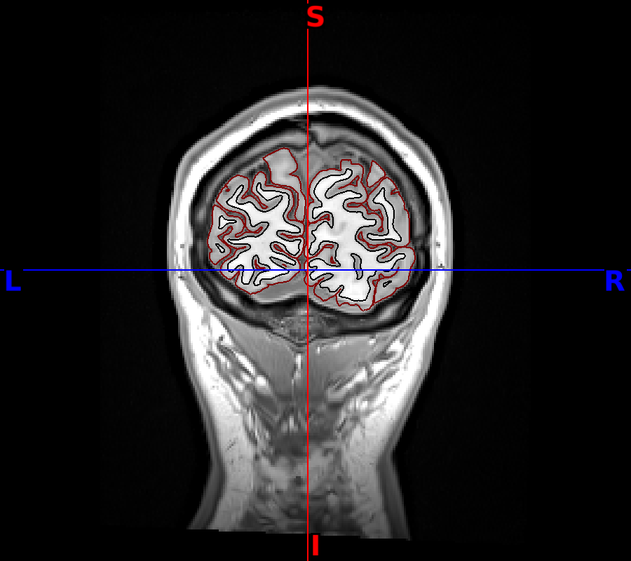
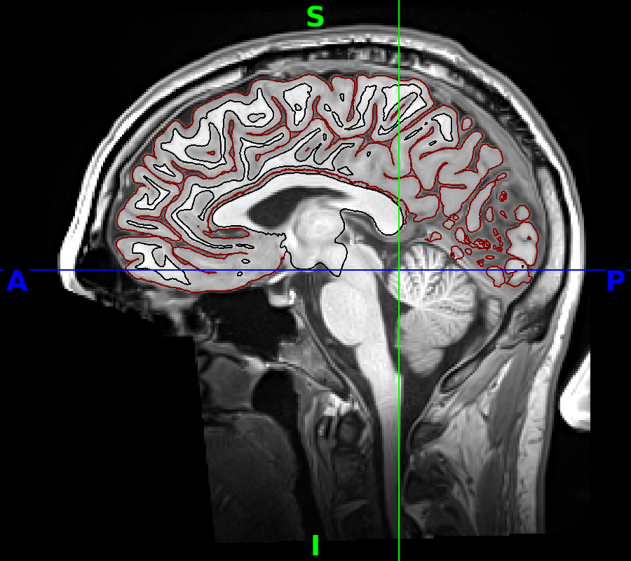
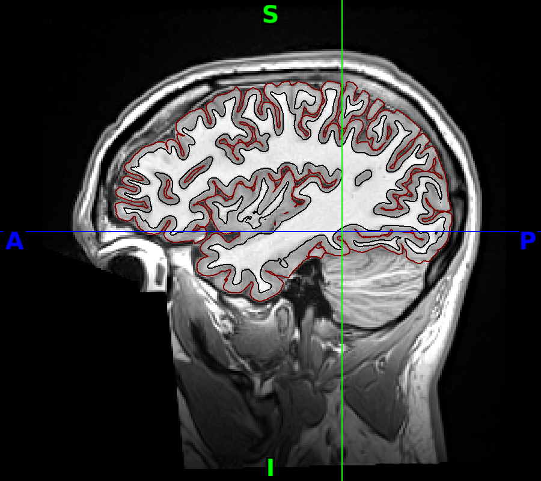

# XCP-D QC

Written by Thomas Tan (Thomas.Tan@camh.ca)

## 1. Purpose and Scope

This QC protocol ensures that all XCP-D outputs meet quality standards before downstream analysis. It is intended for users who have run XCP-D on fMRI data preprocessed with fMRIPrep, HCP pipelines, or ABCD-BIDS. The QC should be completed after each dataset run, before statistical analysis begins.

XCP-D automatically generates:
- Denoised BOLD images
- Parcellated time series
- Functional connectivity matrices
- Quality assessment (QA) reports

It uses the Brain Imaging Data Structure (BIDS) naming convention and is designed to be stable, reliable, and user-friendly. More details can be found [here](https://xcp-d.readthedocs.io/).

## 2. Getting Started

If you haven't run the XCP-D pipeline yet for your dataset, you can use our TIGR-BIDS pipeline to help generate the needed outputs. Instructions for running XCP-D are available in this Git Repo.

> 💡 **Tip:** After running XCP-D successfully, you should see an output folder that looks like the example shown below.

<!-- TODO: insert example output folder screenshot -->

## 3. Quick Reference QC Checklist

**QC Panel 1 – Image Quality Metric**
- [ ] Check DVARS pre vs post
- [ ] Check pre and post DVARS–FD correlation

**QC Panel 2 – Whole-Brain Time Series**
- [ ] Post-processing is smoother
- [ ] DVARS spikes reduced

## 4. Detailed QC Instructions

### QC – Image Quality Control (IQC)

**What to Check:**
- Check if DVARS value is decreased after post-processing.
- Check if DVARS–FD correlation is decreased after post-processing. The post-processing should always be lower than pre.

| | Criteria |
|---|---|
| **Pass** | DVARS lower post-processing (slightly higher is acceptable in rare cases); DVARS–FD correlation is lower post-processing |
| **Uncertain** | — |
| **Fail** | DVARS much higher after processing; DVARS–FD correlation increased post-processing |

**Action if Fail:**
- Check motion regressors in XCP-D output
- Re-run with alternative nuisance regression settings
- Verify correct confounds were selected

### QC – Carpet Plot

**What to Check:**
- Post-processing DVARS should have fewer spikes
- Post-processing whole-brain time series should appear smoother
- Motion (third) plot should look smoother and more consistent as opposed to the pre-processing plot — you should no longer see the noisy bands.

| | Criteria |
|---|---|
| **Pass** | Post-processing series clearly smoother with reduced noise |
| **Uncertain** | — |
| **Fail** | No improvement in smoothness or DVARS spikes remain high |

**Action if Fail:**
- Review nuisance regressors used in denoising
- Test alternative regression model
- Re-run XCP-D with adjusted parameters

**Good Example** (same carpet plots as above — pre vs post):

| Pre-processing | Post-processing |
|---|---|
|  |  |

### QC – Segmentation

**What to Check:**
- No missing or flat blocks in ROI-to-ROI correlations
- Values appear within plausible range (e.g., -1 to +1)

| | Criteria |
|---|---|
| **Pass** | All ROIs represented with plausible correlations |
| **Uncertain** | — |
| **Fail** | Missing ROIs; large flat regions indicating failure in time series extraction |

**Action if Fail:**
- Verify atlas files were applied correctly
- Check parcellated time series files for missing data
- Re-run XCP-D with correct atlas input

**Good Example** — atlas/ROI coverage across the brain (used to visually confirm parcellation was applied correctly before checking the connectivity matrix itself):

<!-- TODO: replace with an actual ROI-to-ROI connectivity matrix heatmap when available -->

| | | |
|---|---|---|
|  |  |  |
|  |  |  |
|  |  |  |

## 3. What to Look for in XCP-D Reports

### Functional-to-T1w Alignment

**What to Check:**
- Does the functional image (usually fuzzier, lower contrast) align with the T1w image (high-resolution anatomical)?
- Are the brain boundaries, ventricles, and major structures aligned?

| | Criteria |
|---|---|
| **Pass** | Functional image fits inside the skull; sulci and ventricles match between the two images |
| **Uncertain** | — |
| **Fail** | Functional brain is shifted, rotated, or outside the skull boundaries; clear mismatch in shape or size |

**Action if Fail:**
- Re-run registration (bbregister) with alternative parameters
- Check T1w and functional image quality/orientation
- Verify correct anatomical reference was used

**Good Example**:

